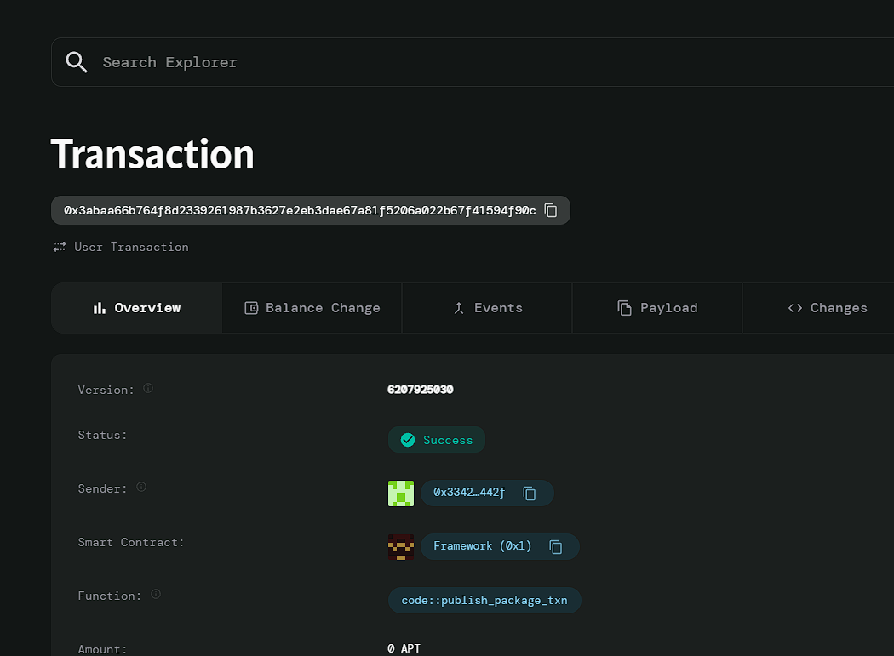

# Supply Chain Financing

## Project Description
A blockchain-based platform that provides small business suppliers with access to short-term financing based on verified purchase orders. The smart contract ensures lenders are repaid once the buyer completes payment, making supply chain financing more efficient and accessible.

## Project Vision
To create a decentralized solution that enables small businesses to access capital quickly and transparently. By using blockchain for financing based on verified purchase orders, suppliers can meet demand, improve cash flow, and grow without the constraints of traditional financing.

## Key Features
- **Easy Financing Access**: Small business suppliers can obtain short-term financing directly through blockchain, bypassing traditional lending hurdles.
- **Automated Repayment**: Once the buyer pays, the contract automatically ensures the lender is repaid, reducing the risk of non-payment.
- **Transparency and Security**: All transactions and terms are recorded on the blockchain, ensuring trust among suppliers, lenders, and buyers.
